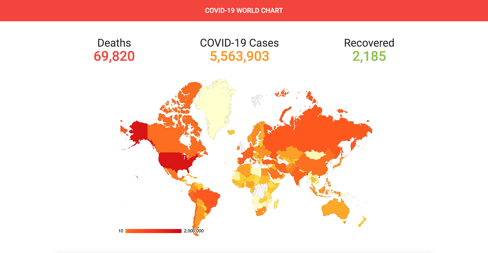
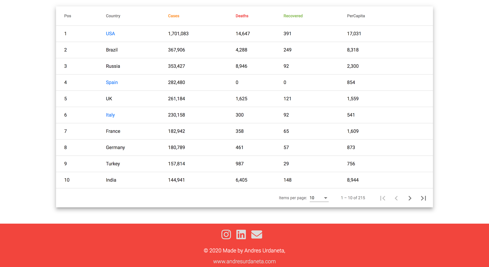

# Covid19

> Coronavirus(COVID-19) World Map Chart is a tool that keeps track of the COVID-19 data in real time, powered with Google GeoMaps

This project was generated with [Angular CLI](https://github.com/angular/angular-cli) version 9.0.6.

### Development server

Run `ng serve` for a dev server. Navigate to `http://localhost:4200/`. The app will automatically reload if you change any of the source files.

### Build

Run `ng build` to build the project. The build artifacts will be stored in the `dist/` directory. Use the `--prod` flag for a production build.

## Screenshots

### Geomap

### Table

